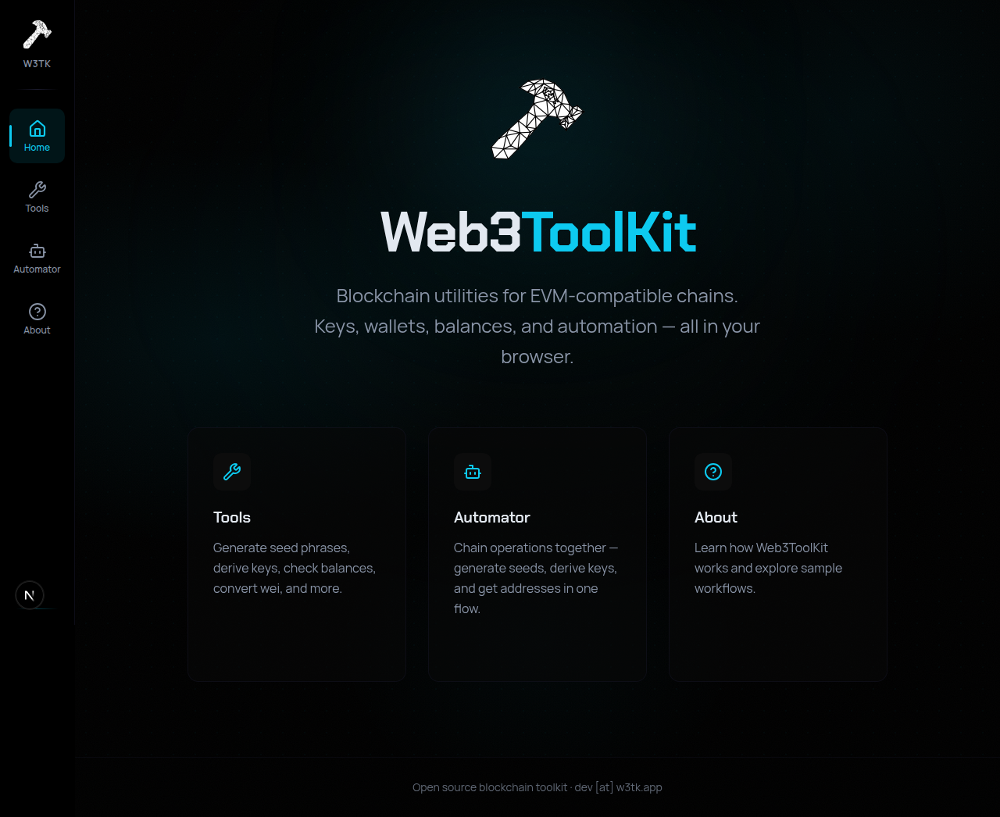
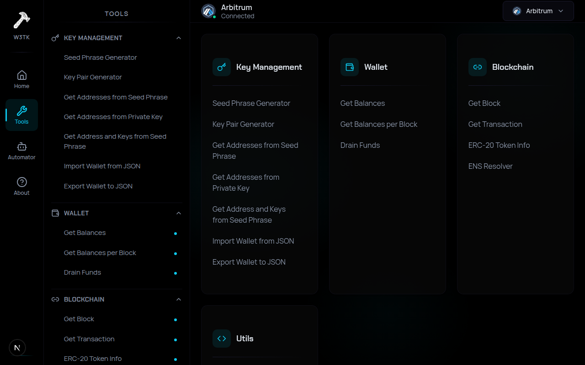
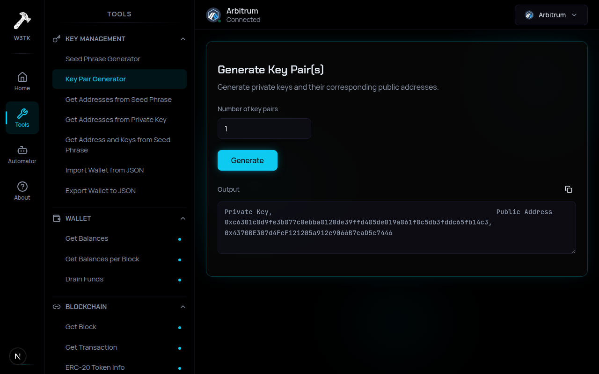
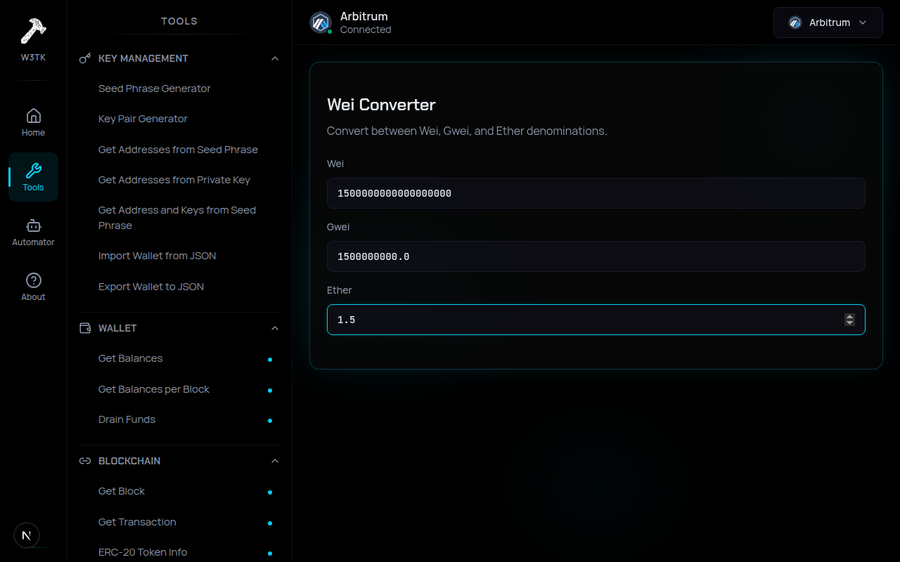
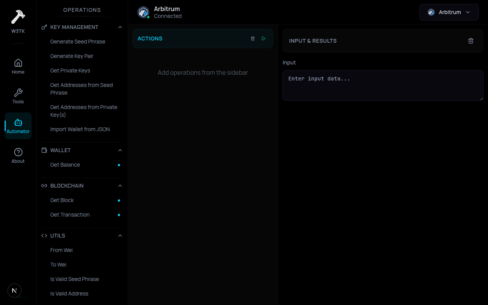

<h1 align="center">
  
  <br />
  Web3ToolKit
</h1>

<p align="center">
  Open-source blockchain utilities for EVM-compatible chains.<br />
  Keys, wallets, balances, and automation — all in your browser.
</p>

<p align="center">
  <a href="https://w3tk.app">
    
  </a>
  <a href="https://github.com/arminreiter/web3toolkit/blob/main/LICENSE">
    
  </a>
  <a href="https://github.com/arminreiter/web3toolkit/actions/workflows/build.yml">
    
  </a>
</p>

<p align="center">
  
</p>

## What is Web3ToolKit?

Web3ToolKit is a static web app that provides blockchain tools for EVM-compatible chains. It runs entirely in the browser — no backend, no server, no accounts. All blockchain calls go directly from the client via RPC.

Try it at **[w3tk.app](https://w3tk.app)** or run it locally. It also ships as a [native desktop app](#desktop-app) via Tauri.

## Screenshots

<table>
  <tr>
    <td align="center"><strong>Tools Overview</strong></td>
    <td align="center"><strong>Key Pair Generator</strong></td>
  </tr>
  <tr>
    <td></td>
    <td></td>
  </tr>
  <tr>
    <td align="center"><strong>Wei Converter</strong></td>
    <td align="center"><strong>Automator</strong></td>
  </tr>
  <tr>
    <td></td>
    <td></td>
  </tr>
</table>

## Tools

### Key Management
- **Seed Phrase Generator** — generate BIP-39 mnemonic phrases
- **Key Pair Generator** — generate private keys and public addresses
- **Get Addresses from Seed Phrase** — derive addresses from a mnemonic
- **Get Addresses from Private Key** — derive addresses from a private key
- **Get Address and Keys from Seed Phrase** — derive full key material from a mnemonic
- **Import Wallet from JSON** — import a V3 keystore file
- **Export Wallet to JSON** — export a private key to V3 keystore

### Wallet
- **Get Balances** — native + ERC-20 token balances
- **Get Balances per Block** — historical balance at specific block numbers
- **Drain Funds** — transfer all funds from one address to another

### Blockchain
- **Get Block** — fetch block data by number or hash
- **Get Transaction** — fetch transaction details
- **ERC-20 Token Info** — read token name, symbol, decimals, supply
- **ENS Resolver** — forward + reverse ENS lookups

### Utils
- **Is Valid Seed Phrase** — validate a BIP-39 mnemonic
- **Is Valid Address** — validate an Ethereum address
- **Wei Converter** — convert between Wei, Gwei, and Ether

## Supported Networks

| Mainnets | Testnets |
|----------|----------|
| Arbitrum | Arbitrum Sepolia |
| Avalanche | Avalanche Fuji |
| Base | Base Sepolia |
| BNB Chain | BNB Testnet |
| Ethereum | Ethereum Sepolia |
| Gnosis | Gnosis Chiado |
| Optimism | Optimism Sepolia |
| Polygon | Polygon Amoy |

Custom networks can be added via the UI and are persisted in localStorage.

## Quick Start

```bash
pnpm install
pnpm dev
```

Open [http://localhost:3000](http://localhost:3000).

## Desktop App

Web3ToolKit is also available as a native desktop app built with [Tauri](https://v2.tauri.app), wrapping the static site in a lightweight native webview.

```bash
pnpm tauri dev     # development with hot reload
pnpm tauri build   # produce platform installers
```

See [docs/DEVELOPMENT.md](docs/DEVELOPMENT.md) for prerequisites and detailed instructions.

## Tech Stack

| | |
|---|---|
| **Framework** | Next.js (App Router), static export |
| **UI** | Tailwind CSS v4, shadcn/ui, Lucide icons |
| **Web3** | ethers v6 (wallet/key ops) |
| **State** | Zustand |
| **Desktop** | Tauri v2 |
| **Tests** | Vitest |
| **CI/CD** | GitHub Actions → Azure Static Web Apps |

## Contributing

See [docs/DEVELOPMENT.md](docs/DEVELOPMENT.md) for the full development guide — building, testing, Tauri setup, versioning, and project structure.

## License

[MIT](LICENSE)
